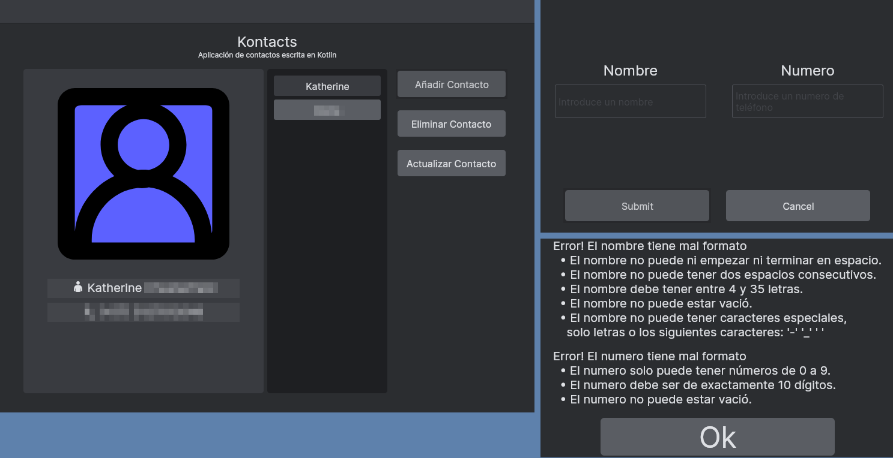

<h1 align="center">Taller 6</h1>
<p align="center">
    *************************
</p>
<p align="center">(Nombre preferido: Katherine)</p>
<p align="center">C.C. *********</p>
<p align="center">*********************************</p>

Fuente: [Github](https://github.com/KatieUmbra/Taller-Seis/tree/main/src/main/kotlin/dev/kaytea/taller/seis)

Descarga la App: [Aqui](https://github.com/KatieUmbra/Taller-Seis/releases)

### Ventana Principal

```kotlin
@OptIn(ExperimentalComposeUiApi::class)
fun main() = application {
        val selectedContact = remember { mutableStateOf<Contact?>(null) }
        Setup.setupIO()
        JBWindow(
            title = "Taller 6",
            resizable = false,
            state = rememberWindowState(size = DpSize(900.dp, 700.dp)),
            onCloseRequest = { exitApplication() },
            theme = DarkTheme,
            showTitle = false,
            alwaysOnTop = false,
            onKeyEvent = {
                if (it.key == Key.Escape && it.type == KeyEventType.KeyDown) {
                    selectedContact.value = null
                }
                false
            }
        ) {
            DarkTheme {
                mainElement(selectedContact)
            }
        }
    }
```

### Componente Principal

```kotlin
@Composable
fun mainElement(selectedContact: MutableState<Contact?>) {
    val padding = 16.dp
    val contactList = remember { mutableStateListOf<Contact>() }
    contactList.addAll(updateContacts())
    Column(
        modifier = Modifier
            .padding(padding)
            .fillMaxSize()
            .background(DarkTheme.Grey2),
        verticalArrangement = Arrangement.Center,
        horizontalAlignment = Alignment.CenterHorizontally,
    ) {
        Label("Kontacts", fontSize = 1.5.em)
        Label("Aplicación de contactos escrita en Kotlin", fontSize = 0.75.em)
        Row(
            modifier = Modifier
                .padding(padding)
                .fillMaxSize(),
            verticalAlignment = Alignment.CenterVertically,
            horizontalArrangement = Arrangement.SpaceEvenly
        ) {
            Box(Modifier.fillMaxHeight().width(400.dp), contentAlignment = Alignment.Center) {
                ContactInfo.contactInfo(selectedContact)
            }
            ContactList.contactList(contactList, selectedContact)
            Column(
                Modifier.fillMaxHeight().width(200.dp),
                horizontalAlignment = Alignment.CenterHorizontally,
                verticalArrangement = Arrangement.Top
            ) {
                AddContact.addContact(contactList)
                Spacer(Modifier.height(16.dp))
                DeleteContact.deleteContact(contactList, selectedContact)
                Spacer(Modifier.height(16.dp))
                UpdateContact.updateContact(contactList, selectedContact)
            }
        }
    }
}
```

### Informacion de contacto

```kotlin
object ContactInfo {
    private fun extractColor(number: String): Color {
        val red = (number.substring(0, 3).toInt() * 346277346) % 255
        val green = (number.substring(3, 6).toInt() * 7895683) % 255
        val blue = (number.substring(6, 9).toInt() * 12345945) % 255
        val alpha = 255
        return Color(red, green, blue, alpha)
    }

    @Composable
    fun contactInfo(selectedUser: MutableState<Contact?>) {
        Column(
            Modifier
                .fillMaxWidth()
                .height(550.dp)
                .background(
                    DarkTheme.Grey3,
                    shape = RoundedCornerShape(5.dp)
                ),
            horizontalAlignment = Alignment.CenterHorizontally
        ) {
            if (selectedUser.value != null) {
                val color = extractColor(selectedUser.value!!.number)
                Box(
                    Modifier.height(350.dp).width(350.dp).padding(32.dp)
                        .background(color, shape = RoundedCornerShape(40.dp))
                ) {
                    Image(
                        painter = painterResource("person.svg"),
                        contentDescription = "Image of a person with default attributes"
                    )
                }
                val labelModifier = Modifier
                    .width(400.dp * 0.8f)
                    .height(32.dp)
                    .background(DarkTheme.Grey4)
                Label(
                    text = "\uD83D\uDC64 " + selectedUser.value!!.name,
                    modifier = labelModifier,
                    fontSize = TextUnit(1.25f, TextUnitType.Em),
                    textAlign = TextAlign.Center
                )
                Spacer(Modifier.height(8.dp))
                Label(
                    "\uD83D\uDCDE (+57) " + selectedUser.value!!.number,
                    modifier = labelModifier,
                    fontSize = TextUnit(1.25f, TextUnitType.Em),
                    textAlign = TextAlign.Center
                )
            }
        }
    }
}
```

### Lista de contactos

```kotlin
object ContactList {
    private fun findShortName(name: String): String {
        var text = name.split(" ")[0]
        if (text.length > 16) text = text.substring(0, 16)
        return text
    }

    @Composable
    fun contactList(contactList: SnapshotStateList<Contact>, selectedContact: MutableState<Contact?>) {
        Box(Modifier.width(200.dp).background(DarkTheme.Grey1, shape = RoundedCornerShape(5.dp))) {
            Box(Modifier.fillMaxSize()) {
                LazyColumn(Modifier.fillMaxSize().padding(8.dp)) {
                    items(contactList) {
                        ContactElement(it, contactList, selectedContact)
                    }
                }
                VerticalScrollbar(
                    modifier = Modifier.align(Alignment.CenterEnd).fillMaxHeight().background(Color.Transparent),
                    adapter = rememberScrollbarAdapter(scrollState = rememberLazyListState(0))
                )
            }
        }
    }

    @OptIn(ExperimentalFoundationApi::class)
    @Composable
    fun ContactElement(
        currentContact: Contact,
        contactList: SnapshotStateList<Contact>,
        selectedContact: MutableState<Contact?>
    ) {
        TooltipArea(
            tooltip = {
                Box(
                    Modifier
                        .background(
                            color = Grey4,
                            shape = RoundedCornerShape(10)
                        )
                        .padding(2.5.dp)
                ) {
                    Label(
                        text = currentContact.name,
                        modifier = Modifier.padding(10.dp)
                    )
                }
            },
            modifier = Modifier,
            delayMillis = 600,
            tooltipPlacement = TooltipPlacement.CursorPoint(
                alignment = Alignment.BottomEnd,
                offset = DpOffset.Zero
            )
        ) {
            val color = if (selectedContact.value == currentContact) DarkTheme.Grey3 else DarkTheme.Grey6
            Box(
                modifier = Modifier
                    .fillMaxWidth()
                    .height(40.0.dp)
                    .padding(2.5.dp)
                    .background(color, RoundedCornerShape(10))
                    .clickable(selectedContact.value != currentContact) {
                        selectedContact.value = contactList.find { it.name == currentContact.name }!!
                    },
                contentAlignment = Alignment.Center
            ) {
                Label(
                    text = findShortName(currentContact.name),
                    fontSize = 1.em,
                    textAlign = TextAlign.Center
                )
            }
        }
    }
}
```

### Nuevo contacto

```kotlin
object AddContact {

    private fun buttonModifier(action: () -> Unit): Modifier {
        return Modifier
            .clickable(enabled = true, onClick = action)
            .padding(2.5.dp)
            .background(DarkTheme.Grey6, RoundedCornerShape(10))
    }

    private var errorList: List<String> = listOf()
    private val errorWindowSize = DpSize(650.dp, 450.dp)
    private val windowSize = DpSize(600.dp, 400.dp)
    private var dialogOpen = mutableStateOf(false)
    private var errorDialogOpen = mutableStateOf(false)

    @Composable
    fun addContact(contactList: SnapshotStateList<Contact>) {
        var isDialogOpen by remember { dialogOpen }
        val isErrorDialogOpen by remember { errorDialogOpen }
        Box(
            buttonModifier { isDialogOpen = true }.width((900.dp / 4) * 0.8f).height(700.dp / 16),
            contentAlignment = Alignment.Center
        ) {
            if (isDialogOpen) addContactDialog(contactList)
            if (isErrorDialogOpen) addErrorDialog()
            Label("Añadir Contacto", modifier = Modifier.padding(10.dp), fontSize = 1.em)
        }
    }

    @OptIn(ExperimentalComposeUiApi::class)
    @Composable
    fun addContactDialog(contactList: SnapshotStateList<Contact>) {
        var isDialogOpen by remember { dialogOpen }
        Dialog(
            onCloseRequest = { isDialogOpen = false },
            state = rememberDialogState(
                position = WindowPosition(Alignment.Center),
                size = windowSize
            ),
            title = "Nuevo contacto",
            resizable = false,
            onKeyEvent = {
                if (it.key == Key.Escape && it.type == KeyEventType.KeyDown) {
                    isDialogOpen = false
                }
                true
            }
        ) {
            DarkTheme {
                Column(
                    Modifier
                        .background(DarkTheme.Grey2)
                        .fillMaxSize(),
                    verticalArrangement = Arrangement.SpaceEvenly,
                    horizontalAlignment = Alignment.CenterHorizontally
                ) {
                    var name by remember { mutableStateOf("") }
                    var number by remember { mutableStateOf("") }

                    var nameError by remember { mutableStateOf(false) }
                    var numberError by remember { mutableStateOf(false) }
                    Row(
                        modifier = Modifier.height((windowSize.height / 4) * 3).width(windowSize.width),
                        verticalAlignment = Alignment.CenterVertically,
                        horizontalArrangement = Arrangement.Start
                    ) {
                        val textFieldModifier = Modifier
                            .width((windowSize.width / 2) * 0.8f)
                            .height(windowSize.height / 8)
                            .background(DarkTheme.Grey6)
                        val textFieldTitleModifier = Modifier
                            .width((windowSize.width / 2) * 0.8f)
                            .height(windowSize.height / 12)
                        val textFieldTitleFontSize = 1.5.em
                        val textFieldPlaceholderModifier = Modifier
                            .background(Color.Transparent)

                        Column(
                            modifier = Modifier.height((windowSize.height / 4) * 3).width(windowSize.width / 2),
                            verticalArrangement = Arrangement.Center,
                            horizontalAlignment = Alignment.CenterHorizontally
                        ) {
                            Label(
                                text = "Nombre",
                                modifier = textFieldTitleModifier,
                                fontSize = textFieldTitleFontSize,
                                textAlign = TextAlign.Center
                            )
                            Spacer(Modifier.height(8.dp))
                            TextField(
                                value = name,
                                modifier = textFieldModifier,
                                onValueChange = { it: String ->
                                    name = it
                                    nameError = Contact.verifyName(it) == null
                                },
                                isError = nameError,
                                textStyle = TextStyle(fontSize = 1.25.em),
                                placeholder = {
                                    Label(
                                        text = "Introduce un nombre",
                                        modifier = textFieldPlaceholderModifier,
                                        fontSize = 1.em,
                                        color = DarkTheme.Grey4
                                    )
                                }
                            )
                        }
                        Column(
                            modifier = Modifier.height((windowSize.height / 4) * 3).width(windowSize.width / 2),
                            verticalArrangement = Arrangement.Center,
                            horizontalAlignment = Alignment.CenterHorizontally
                        ) {
                            Label(
                                "Numero",
                                modifier = textFieldTitleModifier,
                                fontSize = textFieldTitleFontSize,
                                textAlign = TextAlign.Center
                            )
                            Spacer(Modifier.height(8.dp))
                            TextField(
                                value = number,
                                modifier = textFieldModifier,
                                onValueChange = { it: String ->
                                    number = it
                                    numberError = Contact.verifyNumber(it) == null
                                },
                                placeholder = {
                                    Label(
                                        text = "Introduce un numero de teléfono",
                                        modifier = textFieldPlaceholderModifier,
                                        fontSize = 1.em,
                                        color = DarkTheme.Grey4
                                    )
                                },
                                isError = numberError,
                                textStyle = TextStyle(fontSize = 1.25.em)
                            )
                        }
                    }
                    Row(
                        Modifier
                            .fillMaxWidth()
                            .height(windowSize.height / 4)
                            .padding(16.dp),
                        verticalAlignment = Alignment.CenterVertically,
                        horizontalArrangement = Arrangement.SpaceEvenly
                    ) {
                        var isErrorDialogOpen by remember { errorDialogOpen }
                        Box(buttonModifier {
                            contactList.clear()
                            contactList.addAll(updateContacts())
                            val localErrorList = mutableListOf<String>()
                            var success = true

                            val verifiedName = Contact.verifyName(name)
                            val verifiedNumber = Contact.verifyNumber(number)
                            if (verifiedName.isNullOrEmpty()) {
                                success = false
                                localErrorList.add(
                                    "Error! El nombre tiene mal formato\n" +
                                            "  • El nombre no puede ni empezar ni terminar en espacio.\n" +
                                            "  • El nombre no puede tener dos espacios consecutivos.\n" +
                                            "  • El nombre debe tener entre 4 y 35 letras.\n" +
                                            "  • El nombre no puede estar vació.\n" +
                                            "  • El nombre no puede tener caracteres especiales,\n" +
                                            "    solo letras o los siguientes caracteres: '-' '_' ' '"
                                )
                            }
                            if (verifiedNumber.isNullOrEmpty()) {
                                success = false
                                localErrorList.add(
                                    "Error! El numero tiene mal formato\n" +
                                            "  • El numero solo puede tener números de 0 a 9.\n" +
                                            "  • El numero debe ser de exactamente 10 dígitos.\n" +
                                            "  • El numero no puede estar vació."
                                )
                            }
                            if (success) {
                                val verifyExistence = Contact(verifiedName!!, verifiedNumber!!)
                                if (verifyExistence in contactList) {
                                    success = false
                                    localErrorList.add("Error! Ese contacto ya existe.")
                                }
                            }
                            if (success) {
                                if (contactList.find { it.number == verifiedNumber } != null) {
                                    success = false
                                    localErrorList.add("Error! Ya existe un contacto con ese numero.")
                                }
                            }
                            if (success) {
                                val newContactList = Contacts(
                                    contactList
                                        .toMutableList()
                                        .also { it.add(Contact(verifiedName!!, verifiedNumber!!)) }
                                )
                                setContactList(newContactList)
                                contactList.clear()
                                contactList.addAll(updateContacts())
                                isDialogOpen = false
                            } else {
                                errorList = localErrorList
                                isErrorDialogOpen = true
                            }
                        }
                            .width((windowSize.width / 2) * 0.8f)
                            .fillMaxHeight(),
                            contentAlignment = Alignment.Center) {
                            Label("Submit", fontSize = 1.em, textAlign = TextAlign.Center)
                        }
                        Box(buttonModifier {
                            isDialogOpen = false
                        }
                            .width((windowSize.width / 2) * 0.8f)
                            .fillMaxHeight(),
                            contentAlignment = Alignment.Center) {
                            Label("Cancel", fontSize = 1.em, textAlign = TextAlign.Center)
                        }
                    }
                }
            }
        }
    }

    @OptIn(ExperimentalComposeUiApi::class)
    @Composable
    fun addErrorDialog() {
        var isDialogOpen by remember { errorDialogOpen }
        Dialog(
            onCloseRequest = { isDialogOpen = false },
            state = rememberDialogState(
                position = WindowPosition(Alignment.Center),
                size = errorWindowSize
            ),
            onKeyEvent = {
                if (it.key == Key.Escape && it.type == KeyEventType.KeyDown && isDialogOpen) isDialogOpen = false
                false
            }
        ) {
            Column(
                modifier = Modifier
                    .background(DarkTheme.Grey2)
                    .fillMaxSize(),
                verticalArrangement = Arrangement.Center,
                horizontalAlignment = Alignment.CenterHorizontally
            ) {
                Column {
                    for (error in errorList) {
                        Label(text = error, fontSize = 1.25.em)
                        Spacer(Modifier.height(16.dp))
                    }
                }
                Box {
                    Box(
                        modifier = buttonModifier { isDialogOpen = false }
                            .width(errorWindowSize.width * 0.6f)
                            .height(errorWindowSize.height * 0.15f)
                            .align(Alignment.Center),
                        contentAlignment = Alignment.Center
                    ) {
                        Label("Ok", fontSize = 3.em)
                    }
                }
            }
        }
    }
}
```

### Eliminar contacto

```kotlin
object DeleteContact {

    private fun buttonModifier(action: () -> Unit): Modifier {
        return Modifier
            .clickable(enabled = true, onClick = action)
            .padding(2.5.dp)
            .background(DarkTheme.Grey6, RoundedCornerShape(10))
    }

    @Composable
    fun deleteContact(contactList: SnapshotStateList<Contact>, selectedContact: MutableState<Contact?>) {
        val isPromptOpen = remember { mutableStateOf(false) }
        Box(Modifier
            .padding(2.5.dp)
            .background(
                if (selectedContact.value == null) DarkTheme.Grey3 else DarkTheme.Grey6,
                RoundedCornerShape(10)
            )
            .clickable(enabled = selectedContact.value != null) {
                if (selectedContact.value != null) isPromptOpen.value = true
            }
            .width((900.dp / 4) * 0.8f)
            .height(700.dp / 16),
            contentAlignment = Alignment.Center
        ) {
            if (isPromptOpen.value) addDeletePrompt(contactList, selectedContact, isPromptOpen)
            Label("Eliminar Contacto", modifier = Modifier.padding(10.dp), fontSize = 1.em)
        }
    }

    @OptIn(ExperimentalComposeUiApi::class)
    @Composable
    fun addDeletePrompt(
        contactList: SnapshotStateList<Contact>,
        selectedContact: MutableState<Contact?>,
        isPromptOpen: MutableState<Boolean>
    ) {
        val windowSize = DpSize(400.dp, 250.dp)
        Dialog(
            title = "Eliminar Contacto",
            resizable = false,
            onCloseRequest = { isPromptOpen.value = false },
            state = rememberDialogState(
                position = WindowPosition(Alignment.Center),
                size = windowSize
            ),
            onKeyEvent = {
                if (it.key == Key.Escape && it.type == KeyEventType.KeyDown && isPromptOpen.value) {
                    isPromptOpen.value = false
                }
                false
            }
        ) {
            DarkTheme {
                Column(
                    Modifier
                        .background(DarkTheme.Grey2)
                        .fillMaxSize(),
                    verticalArrangement = Arrangement.Bottom,
                    horizontalAlignment = Alignment.CenterHorizontally
                ) {
                    Label(
                        text = "Esta segurx que desea eliminar este contacto?\n" +
                                "(una vez hecho no se va a poder recuperar).",
                        modifier = Modifier.width((windowSize.width) * 0.8f),
                        textAlign = TextAlign.Center,
                        fontSize = 1.1.em
                    )
                    Row(
                        modifier = Modifier.height(windowSize.height / 2)
                            .width(windowSize.width),
                        verticalAlignment = Alignment.CenterVertically,
                        horizontalArrangement = Arrangement.SpaceEvenly
                    ) {
                        Box(buttonModifier {
                            contactList.clear()
                            contactList.addAll(updateContacts())
                            val oldSelected = selectedContact.value!!.copy()
                            val oldContacts = contactList.toList()
                            selectedContact.value = null
                            val newContacts = Contacts(oldContacts.toMutableList().also { it.remove(oldSelected) })
                            setContactList(newContacts)
                            contactList.clear()
                            contactList.addAll(updateContacts())
                            isPromptOpen.value = false
                        }
                            .height((windowSize.height) * 0.2f)
                            .width((windowSize.width / 2) * 0.8f),
                            contentAlignment = Alignment.Center)
                        {
                            Label(
                                text = "Si",
                                modifier = Modifier,
                                textAlign = TextAlign.Center,
                                fontSize = 1.5.em
                            )
                        }
                        Box(buttonModifier { isPromptOpen.value = false }
                            .height((windowSize.height) * 0.2f)
                            .width((windowSize.width / 2) * 0.8f),
                            contentAlignment = Alignment.Center)
                        {
                            Label(
                                text = "No",
                                modifier = Modifier,
                                textAlign = TextAlign.Center,
                                fontSize = 1.5.em
                            )
                        }
                    }
                }
            }
        }
    }
}
```

### Actualizar contacto

```kotlin
object UpdateContact {

    private fun buttonModifier(action: () -> Unit): Modifier {
        return Modifier
            .clickable(enabled = true, onClick = action)
            .padding(2.5.dp)
            .background(DarkTheme.Grey6, RoundedCornerShape(10))
    }

    private val windowSize = DpSize(600.dp, 400.dp)
    private val confirmationWindowSize = DpSize(600.dp, 400.dp)
    private val errorWindowSize = DpSize(650.dp, 450.dp)

    private val errorList = mutableListOf("")
    private lateinit var updatedContact: Contact

    @Composable
    fun updateContact(contactList: SnapshotStateList<Contact>, selectedContact: MutableState<Contact?>) {
        val isDialogOpen = remember { mutableStateOf(false) }
        val isConfirmationDialogOpen = remember { mutableStateOf(false) }
        val isErrorDialogOpen = remember { mutableStateOf(false) }
        if (isDialogOpen.value) updateContactDialog(
            contactList,
            selectedContact,
            isDialogOpen,
            isConfirmationDialogOpen,
            isErrorDialogOpen
        )
        if (isConfirmationDialogOpen.value) updateConfirmationDialog(
            contactList,
            selectedContact,
            isConfirmationDialogOpen,
            isDialogOpen
        )
        if (isErrorDialogOpen.value) updateErrorDialog(
            isErrorDialogOpen
        )
        Box(Modifier
            .padding(2.5.dp)
            .background(
                if (selectedContact.value == null) DarkTheme.Grey3 else DarkTheme.Grey6,
                RoundedCornerShape(10)
            )
            .clickable(enabled = selectedContact.value != null) {
                if (selectedContact.value != null) isDialogOpen.value = true
            }
            .width((900.dp / 4) * 0.8f)
            .height(700.dp / 16),
            contentAlignment = Alignment.Center
        ) {
            Label("Actualizar Contacto", modifier = Modifier.padding(10.dp), fontSize = 1.em)
        }
    }

    @OptIn(ExperimentalComposeUiApi::class)
    @Composable
    fun updateContactDialog(
        contactList: SnapshotStateList<Contact>,
        selectedContact: MutableState<Contact?>,
        isDialogOpen: MutableState<Boolean>,
        isConfirmationDialogOpen: MutableState<Boolean>,
        isErrorDialogOpen: MutableState<Boolean>
    ) {
        Dialog(
            title = "Nuevo contacto",
            resizable = false,
            onCloseRequest = { isDialogOpen.value = false },
            state = rememberDialogState(
                position = WindowPosition(Alignment.Center),
                size = windowSize
            ),
            onKeyEvent = {
                if (it.key == Key.Escape && it.type == KeyEventType.KeyDown) {
                    isDialogOpen.value = false
                }
                true
            }
        ) {
            DarkTheme {
                Column(
                    verticalArrangement = Arrangement.SpaceEvenly,
                    horizontalAlignment = Alignment.CenterHorizontally,
                    modifier = Modifier
                        .background(DarkTheme.Grey2)
                        .fillMaxSize(),
                ) {
                    var name by remember { mutableStateOf(selectedContact.value!!.name) }
                    var number by remember { mutableStateOf(selectedContact.value!!.number) }

                    var nameError by remember { mutableStateOf(false) }
                    var numberError by remember { mutableStateOf(false) }
                    Row(
                        modifier = Modifier.height((windowSize.height / 4) * 3).width(windowSize.width),
                        verticalAlignment = Alignment.CenterVertically,
                        horizontalArrangement = Arrangement.Start
                    ) {
                        val textFieldModifier = Modifier
                            .width((windowSize.width / 2) * 0.8f)
                            .height(windowSize.height / 8)
                            .background(DarkTheme.Grey6)
                        val textFieldTitleModifier = Modifier
                            .width((windowSize.width / 2) * 0.8f)
                            .height(windowSize.height / 12)
                        val textFieldTitleFontSize = 1.5.em
                        Column(
                            modifier = Modifier.height((windowSize.height / 4) * 3).width(windowSize.width / 2),
                            verticalArrangement = Arrangement.Center,
                            horizontalAlignment = Alignment.CenterHorizontally
                        ) {
                            Label(
                                text = "Nombre",
                                modifier = textFieldTitleModifier,
                                fontSize = textFieldTitleFontSize,
                                textAlign = TextAlign.Center
                            )
                            Spacer(Modifier.height(8.dp))
                            TextField(
                                value = name,
                                modifier = textFieldModifier,
                                onValueChange = { it: String ->
                                    name = it
                                    nameError = Contact.verifyName(it) == null
                                },
                                isError = nameError,
                                textStyle = TextStyle(fontSize = 1.25.em),
                                placeholder = {
                                    Label(
                                        text = "Introduce un nombre",
                                        fontSize = 1.em,
                                        color = DarkTheme.Grey4
                                    )
                                }
                            )
                        }
                        Column(
                            modifier = Modifier.height((windowSize.height / 4) * 3).width(windowSize.width / 2),
                            verticalArrangement = Arrangement.Center,
                            horizontalAlignment = Alignment.CenterHorizontally
                        ) {
                            Label(
                                "Numero",
                                modifier = textFieldTitleModifier,
                                fontSize = textFieldTitleFontSize,
                                textAlign = TextAlign.Center
                            )
                            Spacer(Modifier.height(8.dp))
                            TextField(
                                value = number,
                                modifier = textFieldModifier,
                                onValueChange = { it: String ->
                                    number = it
                                    numberError = Contact.verifyNumber(it) == null
                                },
                                placeholder = {
                                    Label(
                                        text = "Introduce un numero de teléfono",
                                        fontSize = 1.em,
                                        color = DarkTheme.Grey4
                                    )
                                },
                                isError = numberError,
                                textStyle = TextStyle(fontSize = 1.25.em)
                            )
                        }
                    }
                    Row(
                        Modifier
                            .fillMaxWidth()
                            .height(windowSize.height / 4)
                            .padding(16.dp),
                        verticalAlignment = Alignment.CenterVertically,
                        horizontalArrangement = Arrangement.SpaceEvenly
                    ) {
                        Box(buttonModifier {
                            contactList.clear()
                            contactList.addAll(updateContacts())
                            errorList.clear()
                            var success = true
                            if (nameError) {
                                success = false
                                errorList.add(
                                    "Error! El nombre tiene mal formato\n" +
                                            "  • El nombre no puede ni empezar ni terminar en espacio.\n" +
                                            "  • El nombre no puede tener dos espacios consecutivos.\n" +
                                            "  • El nombre debe tener entre 4 y 35 letras.\n" +
                                            "  • El nombre no puede estar vació.\n" +
                                            "  • El nombre no puede tener caracteres especiales,\n" +
                                            "    solo letras o los siguientes caracteres: '-' '_' ' '"
                                )
                            }
                            if (numberError) {
                                success = false
                                errorList.add(
                                    "Error! El numero tiene mal formato\n" +
                                            "  • El numero solo puede tener números de 0 a 9.\n" +
                                            "  • El numero debe ser de exactamente 10 dígitos.\n" +
                                            "  • El numero no puede estar vació."
                                )
                            }
                            if (success) {
                                val verifyExistence = Contact(name, number)
                                val newList = contactList.toMutableList()
                                    .also { it.remove(selectedContact.value) }
                                if (verifyExistence in newList) {
                                    success = false
                                    errorList.add("Error! Ese contacto ya existe.")
                                }
                            }
                            if (success) {
                                val newList = contactList.toMutableList()
                                    .also { it.remove(selectedContact.value) }
                                if (newList.find { it.number == number } != null) {
                                    success = false
                                    errorList.add("Error! Ya existe otro contacto con ese numero.")
                                }
                            }
                            if (success) {
                                updatedContact = Contact(name, number)
                                isConfirmationDialogOpen.value = true
                            } else {
                                isErrorDialogOpen.value = true
                            }
                            contactList.clear()
                            contactList.addAll(updateContacts())
                        }
                            .width((windowSize.width / 2) * 0.8f)
                            .fillMaxHeight(),
                            contentAlignment = Alignment.Center) {
                            Label("Submit", fontSize = 1.em, textAlign = TextAlign.Center)
                        }
                        Box(buttonModifier {
                            isDialogOpen.value = false
                        }
                            .width((windowSize.width / 2) * 0.8f)
                            .fillMaxHeight(),
                            contentAlignment = Alignment.Center) {
                            Label("Cancel", fontSize = 1.em, textAlign = TextAlign.Center)
                        }
                    }
                }
            }
        }
    }

    @OptIn(ExperimentalComposeUiApi::class)
    @Composable
    fun updateConfirmationDialog(
        contactList: SnapshotStateList<Contact>,
        selectedContact: MutableState<Contact?>,
        isConfirmationDialogOpen: MutableState<Boolean>,
        isDialogOpen: MutableState<Boolean>
    ) {
        Dialog(
            title = "Eliminar Contacto",
            resizable = false,
            onCloseRequest = { isConfirmationDialogOpen.value = false },
            state = rememberDialogState(
                position = WindowPosition(Alignment.Center),
                size = confirmationWindowSize
            ),
            onKeyEvent = {
                if (it.key == Key.Escape && it.type == KeyEventType.KeyDown && isConfirmationDialogOpen.value) {
                    isConfirmationDialogOpen.value = false
                }
                false
            }
        ) {
            DarkTheme {
                Column(
                    verticalArrangement = Arrangement.Bottom,
                    horizontalAlignment = Alignment.CenterHorizontally,
                    modifier = Modifier
                        .background(DarkTheme.Grey2)
                        .fillMaxSize()
                ) {
                    Label(
                        textAlign = TextAlign.Center,
                        fontSize = 1.1.em,
                        modifier = Modifier.width((confirmationWindowSize.width) * 0.8f),
                        text = if (selectedContact.value == updatedContact) {
                            "No se han realizado cambios."
                        } else {
                            "Esta segurx que desea actualizar este contacto?\n" +
                                    "(una vez hecho no, el contacto anterior no se va a poder recuperar)."
                        }
                    )
                    Row(
                        modifier = Modifier.height(confirmationWindowSize.height / 2)
                            .width(confirmationWindowSize.width),
                        verticalAlignment = Alignment.CenterVertically,
                        horizontalArrangement = Arrangement.SpaceEvenly
                    ) {
                        if (selectedContact.value == updatedContact) {
                            Box(buttonModifier { isConfirmationDialogOpen.value = false }
                                .height((confirmationWindowSize.height) * 0.2f)
                                .width((confirmationWindowSize.width) * 0.8f),
                                contentAlignment = Alignment.Center) {
                                Label(
                                    text = "Ok",
                                    modifier = Modifier,
                                    textAlign = TextAlign.Center,
                                    fontSize = 1.5.em
                                )
                            }
                        } else {
                            Box(buttonModifier {
                                contactList.clear()
                                contactList.addAll(updateContacts())
                                val newContactList = Contacts(
                                    contactList
                                        .toMutableList()
                                        .also { it.remove(selectedContact.value) }
                                        .also { it.add(updatedContact) }
                                )
                                setContactList(newContactList)
                                contactList.clear()
                                contactList.addAll(updateContacts())
                                contactList.clear()
                                contactList.addAll(updateContacts())
                                isConfirmationDialogOpen.value = false
                                isDialogOpen.value = false
                                selectedContact.value = null
                            }
                                .height((confirmationWindowSize.height) * 0.2f)
                                .width((confirmationWindowSize.width / 2) * 0.8f),
                                contentAlignment = Alignment.Center)
                            {
                                Label(
                                    text = "Si",
                                    modifier = Modifier,
                                    textAlign = TextAlign.Center,
                                    fontSize = 1.5.em
                                )
                            }
                            Box(buttonModifier { isConfirmationDialogOpen.value = false }
                                .height((confirmationWindowSize.height) * 0.2f)
                                .width((confirmationWindowSize.width / 2) * 0.8f),
                                contentAlignment = Alignment.Center)
                            {
                                Label(
                                    text = "No",
                                    modifier = Modifier,
                                    textAlign = TextAlign.Center,
                                    fontSize = 1.5.em
                                )
                            }
                        }
                    }
                }
            }
        }
    }

    @OptIn(ExperimentalComposeUiApi::class)
    @Composable
    fun updateErrorDialog(
        isErrorDialogOpen: MutableState<Boolean>
    ) {
        Dialog(
            onCloseRequest = { isErrorDialogOpen.value = false },
            state = rememberDialogState(
                position = WindowPosition(Alignment.Center),
                size = errorWindowSize
            ),
            onKeyEvent = {
                if (it.key == Key.Escape && it.type == KeyEventType.KeyDown && isErrorDialogOpen.value)
                    isErrorDialogOpen.value = false
                false
            }
        ) {
            Column(
                modifier = Modifier
                    .background(DarkTheme.Grey2)
                    .fillMaxSize(),
                verticalArrangement = Arrangement.Center,
                horizontalAlignment = Alignment.CenterHorizontally
            ) {
                Column {
                    for (error in errorList) {
                        Label(text = error, fontSize = 1.25.em)
                        Spacer(Modifier.height(16.dp))
                    }
                }
                Box {
                    Box(
                        modifier = buttonModifier { isErrorDialogOpen.value = false }
                            .width(errorWindowSize.width * 0.6f)
                            .height(errorWindowSize.height * 0.15f)
                            .align(Alignment.Center),
                        contentAlignment = Alignment.Center
                    ) {
                        Label("Ok", fontSize = 3.em)
                    }
                }
            }
        }
    }
}
```

### Serializacion de datos

```kotlin
@Serializable
@SerialName("contact")
data class Contact(
    val name: String,
    val number: String
) {
    companion object {
        @JvmStatic
        fun verifyNumber(number: String): String? {
            val regex = Regex("^[0-9]{10}$")
            return if (regex.matches(number)) number
            else null
        }

        @JvmStatic
        fun verifyName(name: String): String? {
            val regex = Regex("^(?! )(?!.* {2})(?!.* \$)[a-zA-Z-_ ]{4,25}\$")
            return if (regex.matches(name)) name
            else null
        }
    }
}

@Serializable
data class Contacts(
    val contactList: List<Contact>
)
```

### Input de datos al archivo

```kotlin
fun updateContacts(): List<Contact> {
    FileSystem.SYSTEM.read(
        contactsPath
    ) {
        val contactsString = readUtf8()
        val contacts: Contacts = try {
            Yaml.default.decodeFromString<Contacts>(contactsString)
        } catch (_: EmptyYamlDocumentException) {
            Contacts(listOf())
        }
        return@updateContacts contacts.contactList
    }
}
```

### Leer el archivo

```kotlin
fun setContactList(list: Contacts) {
    FileSystem.SYSTEM.write(contactsPath) {
        var allContactsAreValid = true
        for (contact in list.contactList) {
            if (Contact.verifyName(contact.name) == null) allContactsAreValid = false
            if (Contact.verifyNumber(contact.number) == null) allContactsAreValid = false
        }
        if (!allContactsAreValid) {
            println("Can't update. Invalid contact exists.")
            return
        }
        val serializedContacts = Yaml.default.encodeToString(list)
        writeUtf8(serializedContacts)
    }
}
```

### Tareas de inicio

```kotlin
val homeDirectory = System.getProperty("user.home").toPath()
val contactsPath = homeDirectory.resolve(".kontacts/").resolve("contacts.yaml")

object Setup {
    fun setupIO() {
        val dirPath = homeDirectory.resolve(".kontacts/")
        val contactsPath = dirPath.resolve("contacts.yaml")

        val dirExists = FileSystem.SYSTEM.exists(dirPath)
        val contactsExist = FileSystem.SYSTEM.exists(contactsPath)

        if (!dirExists) FileSystem.SYSTEM.createDirectories(dirPath)
        if (!contactsExist) FileSystem.SYSTEM.write(contactsPath) {
            writeUtf8("")
        }
    }
}
```

### Diagrama de clases (UML Tradicional)


### Casos de uso


### Captura de pantalla

